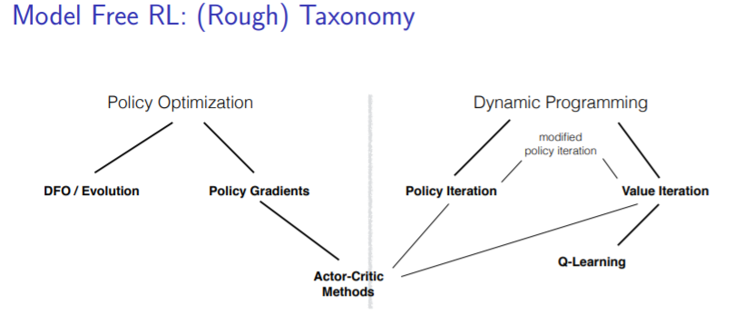

# Game-Sim-ML-in-Finances

## Introduction
### The game
In this project, we try to understand how agents 
interact with each other in a financial market,
that consists of one bond and one stock.
Each period, the assets pay interest / dividend and agents
specify "indifference prices" at which they would be willing to
buy and sell the stock. Based on these "bids", trade is facilitated.
Agents get rewarded for their final wealth.

### Application of RL
We use reinforcement learning (RL) to train the agents in this game.

As discussed in the lecture, one main approach 
to RL is to learn value functions 
to evaluate possible actions depending on the state of the environment.

Alternatively, we can try to learn policies directly
without assigning values to actions.
This is the approach we take here.
Policies are parametrized by a neural network, whose weights
get optimized using a gradient-free optimization algorithm.

source: https://www.microsoft.com/en-us/research/wp-content/uploads/2017/03/Schulman.pdf
### Code structure

The code is mainly seperated into three parts: The game environment, the inupt data generation, and the training loop.

- Game Environment: Contains some parameters to define for instance how many timesteps to trade for, a relatively simple NN that takes as input the return on cash and stock investments and returns a price at which to buy/sell stocks, and a trading algorithm that based on prices computed by the NN and some randomness executes trades among all participating agents at each timestep. 

- Input Data Generation: Generates returns on cash and stocks based on real historic data and computes a horizon price. Within a batch, different data samples differ based on the random time window from which the historical data gets read.

- Training Loop: In each iteration of the training loop each agent gets trained separately. They are trained by optimizing the cumulative rewards over all datasets in the batch using the differential evolution minimizer from tensorflow. The reward for each agent is computed by taking their cash and adding the cash that comes from the number of owned stocks exchanged at the end of the game for the horizon price computed previously. The average price during trading, the average number of trades, and the average rewards for each agent over the entire batch are logged at every iteration and can later be viewed using tensorboard.

## Game description
The game contains parameters on how many timesteps to trade for, the number of agents trading, a NN that determines the prices these agents trade at and a trading algorithm that executes the trading at each timestep which are looped over within the game as well.

### Trading algorithm
The trading algorithm iterates over each agent in a random order. In each iteration it then takes the agent (agent 1) besides the randomly chosen one (agent 0) that offers the lowest price for their stock. If the ask price from agent 1 is lower than the bid price from agent 0, agent 0 then buys as much of the stock from agent 1 as their cash allows. Agent 0 is now removed from the pool of agents and the next iteration begins by choosing the next agent at random. The prices each agent sets for their stock are recomputed after every trade using the NN.

### Paying out the final reward
The final reward is payed out as all the cash an agent holds plus all of their stock exchanged for cash at the horizon price computed in the input data generation.

## Training
- Each agent's objective is to maximize its average reward
over multiple game scenarios that constitute the training batch.
Each game scenario includes interest rate and dividend data.

- To resemble realistic dividends and interest rates,
data is generated from the annual dividend yield of the S&P 500
and the corresponding risk-free rate in the year.
The dividend yield of 20 years following the sampled time period
is used to estimate the horizon price.

- Both agents get trained in alternation.

#### Differential Evolution
- The policy weights of the agents are updated via [differential evolution (DE)](https://www.tensorflow.org/probability/api_docs/python/tfp/optimizer/differential_evolution_minimize).
As opposed to more commonly applied gradient based optimization,
DE does not rely on differentiability of the objective function.
Instead, parameters get updated via the following algorithm:

source:  Shukla, Richa, et al. "Variant of differential evolution algorithm." Advances in computer and computational sciences. Springer, Singapore, 2017. 601-608.

- Parameter choices and initialization seem to be crucial to the result of the algorithm.

## Results
To keep things simple we started out only training a scenario with two agents in order to see if convergence was even possible for the simplest case.
We could see that starting our training with the parameters defined in example.py the average prices for which the stocks were trading would converge somewhere around 175.

In this example we can see that starting to train with prices above 200 would have them fall steadily:
https://tensorboard.dev/experiment/y50sBqELRmGPzvvI7MyEFw/#scalars

In another example we saw that starting with prices around 100 would have them rise up steadily during the training:
https://tensorboard.dev/experiment/ABC9UZErTGGaZmKwNj0f1w/#scalars
https://tensorboard.dev/experiment/MwzByVCDQOO2ofgek2yqsg/#scalars (longer)

Setting the prices at 175 in the beginning would let us see that they would stay around this range:
https://tensorboard.dev/experiment/Ln4K7bKCRkKrbxzo9bzOjA/#scalars

We could however also see in this previous example that this seems to be a local minimum where one of the agents gets the upper hand, always increasing it's reward when it's turn to optimize comes around. The other agent however doesn't manage to gain back all of the advantage in it's own turn.

## Issues with current implementation
There are many possible reasons why we do not see the results that we may we have hoped for.
- Issues related to the game
  - Agents are required to engage in trading, potentially giving up all their stock holdings
- Issues related to the model of the agent's
  - Choice of shallow NN, where input is only the last return
  - Better: 
    - incorporate time dimension (e.g., output layer with different places for output in different periods)
    - Give agents more information: current holdings
- Issues related to parameter choices
  - Optimizer highly sensitive to parameters and initialization. We possibly did not find a good set of parameters.
  - Sequential nature of game makes training slow and exploration of hyperparameters difficult

- Possible also issues related to the optimization itself (suited for this task?)

## Future Work
We could see in the previous section that some kind of convergence is definitely possible but this wasn't really the convergence we were looking for, and also it was only tested in the simplest two agent scenario.

### Finding a stable optimum for two agents
First we would suggest continuing to stick to the two agent scenario and trying to find an optimum where both agents have maximized their rewards in a simillar manner.
There are many paths to persue in order to possibly reach this goal but in order to get our first bearings it would probably be useful to do some ensemble training. In the ensemble training we would do small runs while testing several combinations of training parameters such as epochs trained for, population size, population deviation and others. If all else fails it is of course also possible to experiment with the NN architecture, which at the moment only has one dense hidden layer.

### Generalizing to more agents
If there is a set of parameters found that leads to finding a stable optimum with two agents the next step would be to take these parameters and see if they can be generalized to more agent scenarios. If that doesn't work of course one could also do ensemble training here and see what the differences to doing this in the previous setting would be. Questions like: "Do we need to scale the population size with which we train according to the number of agents?" could be interesting.
